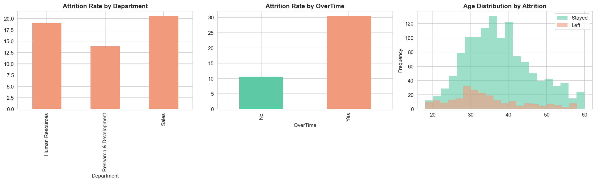
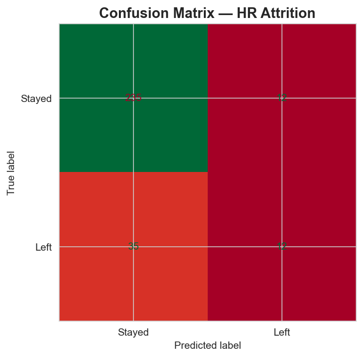
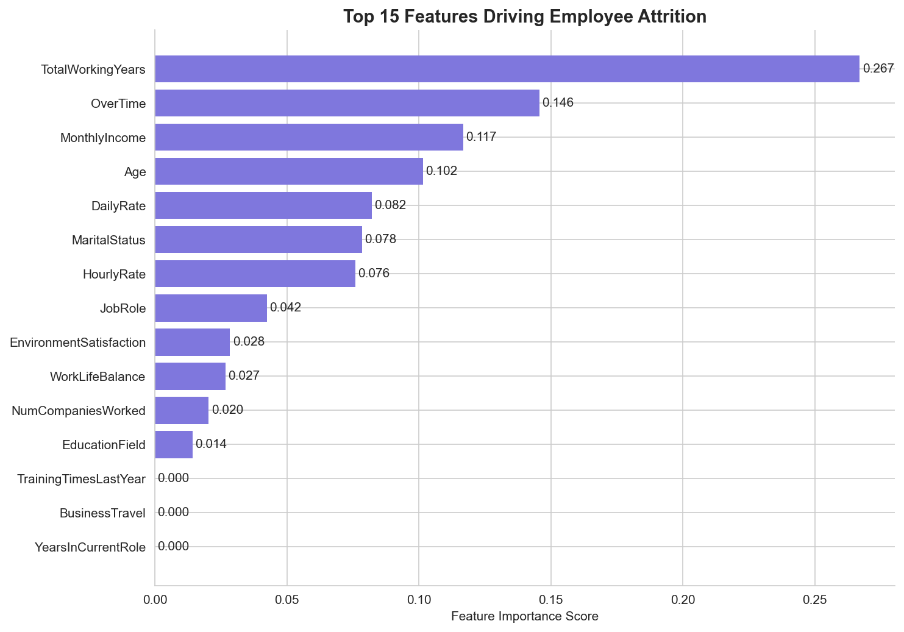

# HR Employee Attrition Prediction
### Can we predict which employees will leave — before they do?


---

##  Business Problem

Employee attrition is one of the most expensive challenges for any organization — replacing a single employee can cost **50–200% of their annual salary**.

The HR team needs to know: **which employees are most likely to leave, and why?**

This project builds a **Decision Tree classifier** to answer that question — and explains the reasoning in terms any HR manager can understand.

---

##  Dataset

| Detail | Value |
|--------|-------|
| Source | [IBM HR Analytics — Kaggle](https://www.kaggle.com/datasets/pavansubhasht/ibm-hr-analytics-attrition-dataset) |
| Employees | 1,470 |
| Features | 35 |
| Target | Attrition (Yes / No) |
| Attrition Rate | ~16% |

---

##  Project Workflow

```
1. Exploratory Data Analysis (EDA)
        ↓
2. Data Preprocessing & Encoding
        ↓
3. Decision Tree Model Training
        ↓
4. Model Evaluation (Accuracy + Confusion Matrix)
        ↓
5. Feature Importance Analysis
        ↓
6. Business Recommendations
```

---

##  EDA Highlights



Key patterns discovered:
- **Sales department** has the highest attrition rate
- Employees working **OverTime** leave at a significantly higher rate
- **Younger employees (25–35)** are more likely to leave than older ones

---

##  Model Performance

| Metric | Score |
|--------|-------|
| **Accuracy** | **84%** |
| Algorithm | Decision Tree Classifier |
| Max Depth | 5 |
| Train / Test Split | 80% / 20% |
| Stratified | ✅ Yes |

> Why Decision Tree? Because HR decisions affect real people. Stakeholders need to understand **why** an employee was flagged — not just that the model said so. Decision Trees are fully explainable.

### Confusion Matrix



---

##  Top 3 Attrition Drivers



| Rank | Feature | Business Insight |
|------|---------|-----------------|
|  1 | **Total Working Years** | Employees early in their careers leave more — they're still exploring options and lack long-term commitment |
|  2 | **OverTime** | Overworked employees burn out — this is the most actionable factor HR can control directly |
|  3 | **Monthly Income** | Compensation matters — lower-paid employees are consistently at higher risk of leaving |

---

##  Business Recommendations

Based on the model findings, here are **4 actionable steps** for the HR team:

**1.  Control Overtime**
Cap overtime hours or introduce overtime compensation. Employees on heavy overtime are at the highest attrition risk — and this is directly within HR's control.

**2.  Conduct Salary Benchmarking**
Regularly compare salaries against market rates, especially for junior and mid-level employees. A small salary gap can lead to large attrition costs.

**3.  Invest in Early Career Development**
Employees in their first 1–3 years need clear growth paths and mentorship. Structured onboarding and development programs significantly reduce early attrition.

**4.  Build a Proactive Risk Score**
Use this model to generate a monthly attrition risk score for each employee. Flag high-risk profiles (low income + high overtime + low working years) for proactive HR intervention.

---

##  Project Structure

```
IBM-HR-Analytics-Employee-Attrition-Performance/
│
├── IBM HR Analytics Employee Attrition & Performance.ipynb  ← Main notebook
├── WA_Fn-UseC_-HR-Employee-Attrition.csv                   ← Dataset
├── hr_eda.png                                               ← EDA visualization
├── feature_importance.png                                   ← Top attrition drivers
├── confusion_matrix.png                                     ← Model evaluation
└── README.md
```

---

##  How to Run

```bash
# 1. Clone the repo
git clone https://github.com/RaniaMofeed/IBM-HR-Analytics-Employee-Attrition-Performance.git

# 2. Install requirements
pip install pandas numpy matplotlib seaborn scikit-learn

# 3. Open the notebook
jupyter notebook "IBM HR Analytics Employee Attrition & Performance.ipynb"
```

---

*Analysis by **Rania Mofeed** | [LinkedIn](https://www.linkedin.com/in/raniamofeed) | [GitHub](https://github.com/RaniaMofeed)*
